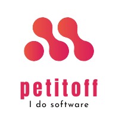

<!-- <h1 align="center">Hi 👋, I'm petitoff</h1> -->

# 💫 About Me:
- 🎓 Student of Opole University
- 💼 Intern in codefusion
- 📈 Software and web developer
- ❤️ AI and machine learning

## 🌐 Socials:
 

# 💻 Tech Stack:
                             	 
# 📊 GitHub Stats:
 
 

## 🏆 GitHub Trophies

### ✍️ Random Dev Quote

